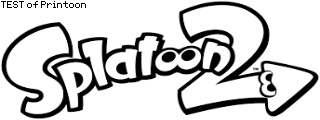

## Printoon beta 版

[Splatoon 2][splatoon2] の投稿に、指定した画像を自動でドット打ちするツールです。

Printoon の最大の特徴は、使用中の PC そのものを Bluetooth 経由で Pro コントローラーとして認識させることです。したがって Bluetooth 内蔵の環境あるいは外付けの Bluetooth アダプタがあれば、Printoon を使用できます。マイコンボードなどの追加のデバイスは必要ありません。

動作には Linux 環境が必要ですが、VirtualBox などの仮想化ソフトウェアを利用すれば Windows や macOS 上でも環境を準備できます。Splatoon の画像投稿の敷居をグンと下げるツールだと確信していますので是非使ってみてほしいと思います!!

このプロジェクトでは [NXBT][nxbt] を使用させていただいております。NXBT は Python で作成された、Pro コントローラーの Bluetooth 経由でのエミュレートができるツールおよびライブラリです。このプロジェクトの核となっています。

### Printoon の主な特徴

- PC そのものを Bluetooth 経由で Pro コントローラーとして認識させます。
- 画像を自動でリサイズした上でディザリング加工します。
- 反転モードを用意しています。白い部分をプロットすることができます。
- 画像の確認もでき操作が簡単な簡易 GUI が一応あります。

### 動作確認済み環境

- Windows 10 Home バージョン 2004 ビルド 19041.746
    - Ubuntu 20.04.1 LTS (64 bit)
    - VirtualBox 6.1.16

macOS と Linux では動作確認が取れていません。もし成功した方は、可能な範囲のバージョン情報とともにお知らせいただけると幸いです。

### サンプル画像

テスト用のサンプル画像が sample-images ディレクトリにあります。

### splatoon2.png

### VirtualBox の準備

Printoon の動作には Bluetooth と Linux 環境が必須です。このうち Linux 環境については Windows や macOS を使用している場合でも仮想的に構築できますが、準備が複雑なので下にある別リンク先で説明します。それでもマイコンボードを利用する方法よりは直感的で楽かもしれません。

> [VirtualBox の準備](./setup-linux/index.md)

### Printoon のインストールと使用

Printoon は Bash スクリプトで頑張って作りましたが、簡単な GUI も用意しています。使い方を下記リンク先で説明しています。

> [Printoon のインストールと使用](./usage/index.md)

### ライセンス

Printoon は MIT ライセンスとします。

> [ライセンス文書](https://github.com/rtanpo440/printoon/blob/master/LICENSE)

[splatoon2]: https://www.nintendo.co.jp/switch/aab6a/index.html
[nxbt]: https://github.com/Brikwerk/nxbt/
