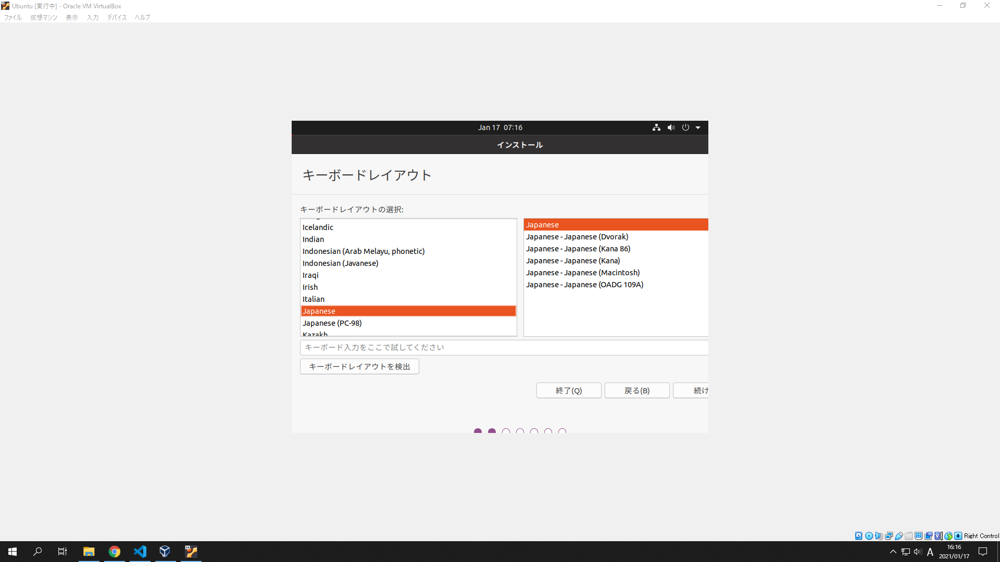

## VirtualBox の準備

    <a href="../usage/index.md">Printoon のインストールと使用</a> →

 

Printoon をインストールする前に必要な準備の手順を説明します。

ここは Linux 以外の環境の方向けの、Ubuntu のインストールの説明となります。

### VirtualBox のダウンロード

次のリンクからサイトにアクセスして VirtualBox をダウンロードします。Windows を使用している場合は “Windows hosts” を、macOS を使用している場合は “OS X hosts” のリンクをクリックします。

> [Downloads - Oracle VM VirtualBox](https://www.virtualbox.org/wiki/Downloads)

### VirtualBox のインストール

ダウンロードが終わったら、そのファイルを起動します。基本的にはデフォルトの状態のままで Next や Yes といったボタンを押して進めれば大丈夫です。ただし、メニューアイコンやデスクトップ上のショートカットの自動作成を望まない場合は、適宜チェックボックスのチェックを外してください。

なお、インストール処理中、一時的にネットワーク接続が切れます。( その旨の警告が表示されます )

### 仮想マシンの作成

スタートメニューなどのアイコンから VirtualBox を起動すると、次のような画面になります。これから新しい仮想 Linux 環境を作成するので “新規” をクリックします。

名前には Ubuntu を含めると、タイプとバージョンが自動で選択されます。

メモリの容量を設定します。最低 1024MB 以上が推奨されています。

仮想ハードディスクについては、デフォルトで作成すると選ばれていると思いますので、そのまま “作成” をクリックします。

新しいダイアログが出てきます。選択は VDI のまま進みます。

可変サイズのまま次に進みます。

次の画面でハードディスクのサイズを設定します。システムファイルで 5GB ほど埋まってしまうため通常使用では 12GB 前後が無難かと思います。

仮想マシンが作成されました。ここで起動する前に、だいじなだいじな Ubuntu イメージのダウンロードを行います。ウィンドウはあとで使うのでそのままにしておきます。

### Ubuntu のダウンロード

ここでは Ubuntu というディストリビューションを使用します。下記リンク先の上部に最新バージョンのリンクがあるのでクリックし、Desktop image の右にあるリンクをクリックすると iso イメージのダウンロードがはじまります。バージョン名の LTS は長期サポートを意味しています。

> [Ubuntu Releases](http://www.releases.ubuntu.com/)

### 仮想マシンの起動

VirtualBox の画面に戻って、仮想マシンを起動します。

はじめて起動する際は次のような画面が出ます。ここで先ほどの iso イメージを選ぶので右のアイコンをクリックします。

“追加” をクリックして、ダウンロードした iso イメージを選びます。“選択” “起動” とクリックしてください。

### Ubuntu のインストール

しばらく待つと、次の画面が現れます。デフォルトでは英語になっていますが、左側のリストの一番下に “日本語” という項目があります。そこをクリックすると日本語になります。””

“Ubuntu をインストール” をクリックします。

キーボードレイアウトは通常デフォルトで問題ないので “続ける” をクリックします。

次の画面では他のソフトウェアのインストールについて質問されますが、Printoon だけに使うのなら “最小インストール” で構わないかと思います。

“インストール” をクリック。

“続ける” をクリック。

居住国を適切に設定して “続ける” をクリック。

最後に、ユーザー情報を設定します。確認できたら “続ける” をクリックします。このボタンを押すとインストールがはじまります。

インストールは、8-10 分で終わります。インストールが終わると再起動を促されますので、再起動します。

次の画面が現れたら、Enter キーを押してください。

その後ログインが完了するとデスクトップ画面です!! 大変な作業は殆ど乗り越えました。あとは共有フォルダーの機能を使用可能にするため、Guest Additions の追加を行います。

### Guest Additions のインストール

VirtualBox には使用中の OS と仮想マシン内との間でフォルダーやクリップボードを共有する機能がありますが、そのままでは利用できません。Guest Additions というものを、仮想マシン側にいれる必要があります。使用中の PC 上の画像をプロットするには、共有フォルダ―機能の使用が一番便利です。

VirtualBox からGuest Additions をインストールするには、“デバイス” メニューから “Guest Additions CD イメージの挿入...” をクリックします。

このような画面が現れたら、“実行” をクリックします。

パスワードを求められるので先ほど設定したパスワードを入力します。

Press Return to close... と表示されたら、Enter キーを押して閉じます。

このあと VirtualBox を再起動すれば機能が使用可能になります。

### 共有フォルダーの追加

PC 上の画像を Ubuntu から参照するため共有フォルダーを追加します。“デバイス” > “共有フォルダー” > “共有フォルダー設定...” のメニューを開きます。

フォルダーまたはドライブを選びます。マウントポイントは /mnt/ からはじめればひとまず問題ないと思います。最後に “OK” をクリックします。

### Bluetooth アダプタの設定

USB 接続の Bluetooth アダプタを使用している場合は、右下の USB アイコンを右クリックし、該当するデバイス名をクリックしてください。

### Printoon インストールの準備 OK!!

お疲れ様です。Printoon をインストールする準備が整いました。Printoon のインストールには、それほど手間はかかりません。

 

    <a href="../usage/index.md">Printoon のインストールと使用</a> →

